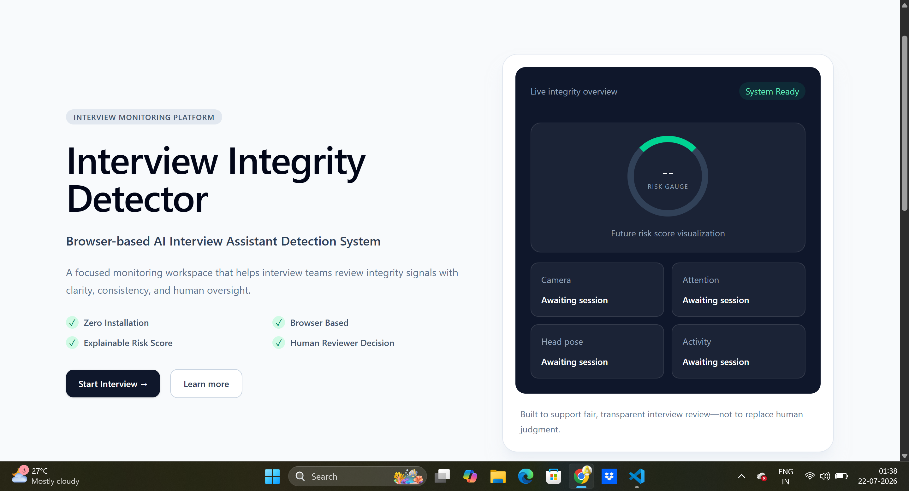
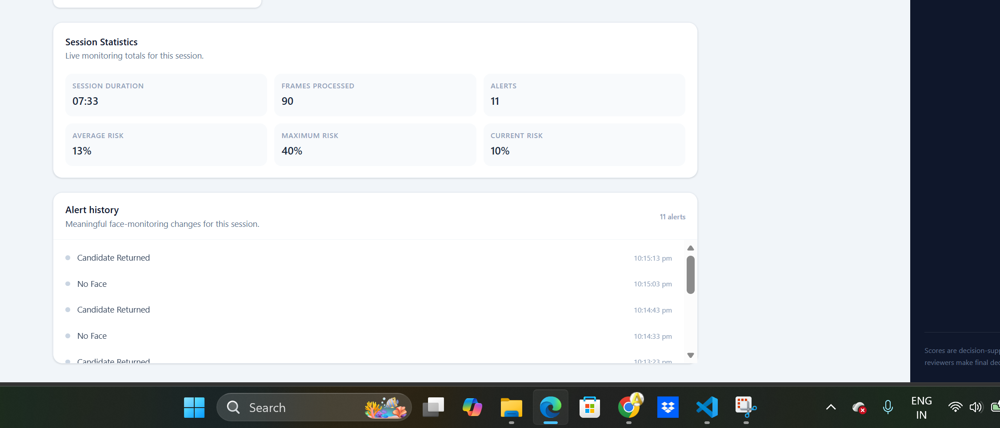
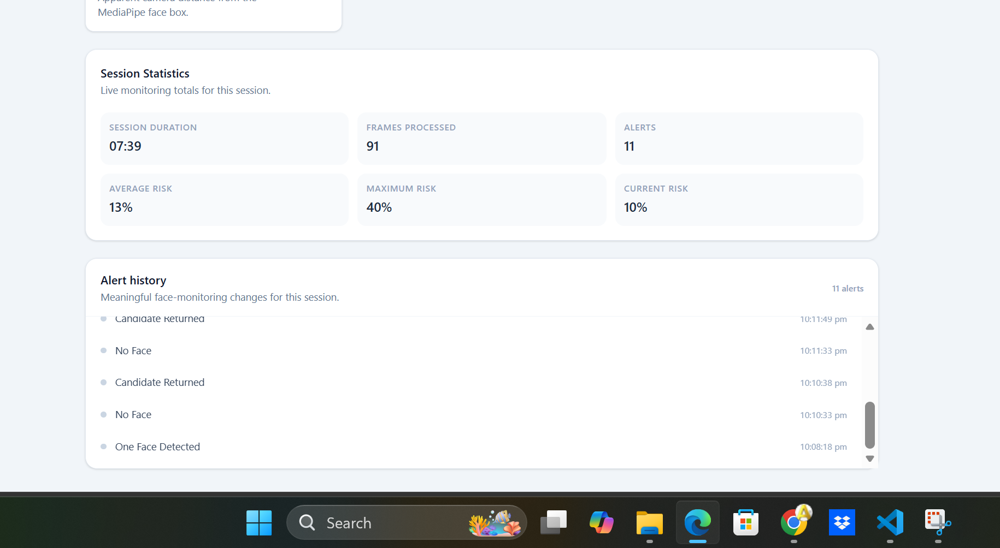
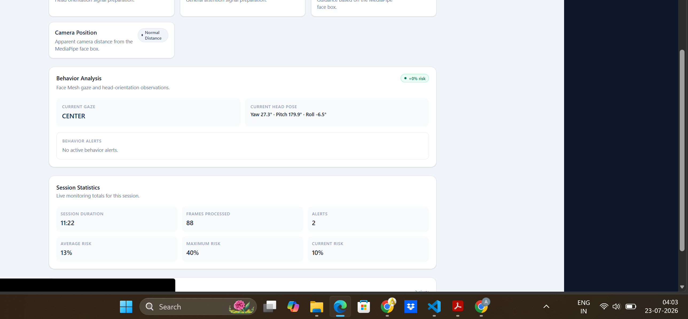

# Interview Integrity Detector

[](https://react.dev/)
[](https://fastapi.tiangolo.com/)
[](https://ai.google.dev/edge/mediapipe/solutions/guide)
[](https://www.python.org/)
[](LICENSE)

> Zero-install, browser-based interview integrity monitoring prototype powered by React, FastAPI, OpenCV, and Google MediaPipe.

## Hackathon

**Built for the InCruiter Hackathon**  
**Problem Statement:** “Catch the Invisible AI Cheater”

## Project Overview

Interview Integrity Detector is a browser-based prototype that supports structured review of remote interview sessions. After the candidate provides consent and browser camera permission, the React application captures a resized JPEG frame from the preview every five seconds and sends it to the FastAPI backend.

The backend processes only the submitted frame. It performs face-count monitoring, face framing validation, and independent behavior analysis, then returns an explainable risk assessment to the dashboard. The dashboard presents current signals, risk contribution, session-only alerts, live statistics, and an end-of-session summary.

The system analyzes observable interview behavior and monitoring signals to assist human reviewers through explainable risk assessment. It does not claim to identify hidden AI software or guarantee detection of every cheating method.

## Problem Statement

Remote interviews make it difficult to establish consistent interview conditions while maintaining a practical candidate experience. Reviewers may need context when expected visual conditions change, such as no visible face, multiple faces, persistent off-screen gaze, or repeated head orientation away from the camera.

This project addresses those observable signals through a zero-install browser workflow. Its outputs are decision-support information only; final decisions remain with human reviewers.

## Features

| Area | Implemented capability |
| --- | --- |
| Browser workflow | Consent-first webcam capture, local preview, Base64 JPEG transfer, and no candidate-side software installation |
| Face monitoring | Face detection, face-count monitoring, one-face, no-face, and multiple-face states |
| Framing guidance | Face-position guidance and apparent camera-distance validation from MediaPipe relative bounding boxes |
| Behavior analysis | Coarse gaze direction, yaw/pitch/roll head pose, behavior history, and behavior alerts |
| Explainable risk | Rule-based face-count risk plus behavior-risk contribution, capped at 100 |
| Session review | Timestamped alert history, live session statistics, and an end-of-session monitoring summary |
| Dashboard | Responsive React dashboard, loading/error states, retry action, and five-second polling |

## Technology Stack

| Area | Technologies actually used |
| --- | --- |
| Frontend | React, TypeScript, Vite, Tailwind CSS |
| Routing and API client | React Router, Axios |
| Backend | Python, FastAPI, Pydantic, Uvicorn |
| Computer vision | OpenCV, NumPy, Google MediaPipe Face Detection, Google MediaPipe Face Mesh |
| Packaging | Docker, Docker Compose |

## Architecture

```text
Browser Camera
      |
      v
React CameraView
      |
      v
Resize frame (maximum ~640 x 480) + JPEG encode (78% quality)
      |
      v
POST /analyze with Base64 image
      |
      v
FastAPI Frame Decoder
      |
      +-------------------------------+
      |                               |
      v                               v
MediaPipe Face Detection       MediaPipe Face Mesh
      |                               |
      v                               v
Face Count + Framing           Gaze + Head Pose + History
      |                               |
      +---------------+---------------+
                      v
          Explainable Rule-Based Risk Engine
                      |
                      v
              AnalyzeResponse
                      |
                      v
React Reviewer Dashboard
```

> The backend never calls `cv2.VideoCapture()`. The browser owns the webcam, and the backend analyzes only frames received through `POST /analyze`.

## Detection Workflow

1. The candidate starts an interview, reviews the consent information, and grants browser camera access.
2. The frontend displays the webcam preview and captures a current frame every five seconds while the session is active.
3. The frame is reduced to a maximum of approximately 640×480, JPEG-encoded at 78% quality, Base64-encoded, and submitted to `POST /analyze`.
4. FastAPI decodes the image into an OpenCV BGR frame.
5. MediaPipe Face Detection determines face count and, for exactly one face, supplies a relative bounding box for position and distance guidance.
6. MediaPipe Face Mesh independently estimates coarse gaze direction and landmarks for OpenCV `solvePnP()` head-pose estimation.
7. Behavior history evaluates repeated off-screen gaze and persistent yaw observations across configurable consecutive frames.
8. The risk engine combines the established face-count score with any active behavior contribution and returns a capped result.
9. The React dashboard updates monitoring cards, behavior data, alert history, session statistics, and the final summary.

## Explainable Risk Assessment

Risk is generated from visible, documented signals rather than an opaque model. The face-count rules are applied first; then active behavior alerts can contribute additional risk. The final score is capped at 100 and mapped to a status and recommendation.

| Face detection state | Base risk | Status without behavior contribution | Recommendation without behavior contribution |
| --- | ---: | --- | --- |
| One Face Detected | 10% | System Ready | Monitoring |
| No Face | 40% | Attention Required | Review Session |
| Multiple Faces | 60% | High Risk | Investigate |

Behavior observations are evaluated only when one face is available for Face Mesh analysis. After the configured consecutive-frame threshold is met, `Prolonged Off-Screen Gaze` and `Persistent Head Orientation` can each add the configured behavior-risk contribution. The existing face-count rules remain unchanged.

## Backend API

| Method | Endpoint | Description |
| --- | --- | --- |
| `GET` | `/` | Returns application metadata and status. |
| `GET` | `/health` | Returns the current static backend health payload. |
| `POST` | `/analyze` | Accepts one browser-captured JPEG frame and returns monitoring data. |

### `GET /`

```json
{
  "application": "Interview Integrity Detector",
  "version": "1.0",
  "status": "Running"
}
```

### `GET /health`

```json
{
  "backend": "Healthy",
  "camera": "Not Connected",
  "model": "Not Loaded",
  "uptime": "OK"
}
```

### `POST /analyze`

Request body:

```json
{
  "frame_id": 1,
  "timestamp": "2026-07-23T12:00:00Z",
  "image": "base64-encoded-jpeg-data"
}
```

Response body:

```json
{
  "risk_score": 10,
  "status": "System Ready",
  "signals": {
    "camera": "Active",
    "face_detection": "One Face Detected",
    "eye_tracking": "Pending",
    "head_pose": "Pending",
    "attention": "Pending"
  },
  "face_position": "Centered",
  "face_distance": "Normal Distance",
  "behavior": {
    "gaze_direction": "CENTER",
    "head_pose": {
      "yaw": 2.1,
      "pitch": -1.3,
      "roll": 0.4
    },
    "behavior_alerts": [],
    "behavior_risk": 0
  },
  "recommendation": "Monitoring"
}
```

`signals.head_pose` remains `Pending` because it is reserved for the original signal group; the implemented behavior head-pose angles are returned in `behavior.head_pose`.

## Current Capabilities

- Face detection and face-count monitoring for zero, one, or multiple faces
- Face position and apparent distance guidance for one detected face
- Coarse gaze directions: `CENTER`, `LEFT`, `RIGHT`, `UP`, and `DOWN`
- Head pose with yaw, pitch, and roll values estimated by OpenCV `solvePnP()`
- Configurable consecutive-frame behavior history for off-screen gaze and head orientation
- Current-session alert history with timestamps and consecutive duplicate face-state suppression
- Live duration, frames processed, alert count, current risk, average risk, and maximum risk
- End session action that stops polling and displays the monitoring summary

## Installation and Setup

### Prerequisites

- Node.js 20 or later
- Python 3.11 or later
- A browser with webcam support and permission enabled

### Backend

```powershell
cd backend
python -m venv .venv
.\.venv\Scripts\Activate.ps1
pip install -r requirements.txt
uvicorn app.main:app --reload --port 8000
```

The API runs at `http://localhost:8000`. Interactive API documentation is available at `http://localhost:8000/docs`.

### Frontend

Open a second terminal:

```powershell
cd frontend
npm install
npm run dev
```

Open the Vite URL shown in the terminal, normally `http://localhost:5173`.

### Docker

```bash
docker compose up --build
```

Docker serves the frontend at `http://localhost:5173` and the backend at `http://localhost:8000`.

## Usage

1. Start the backend and frontend.
2. Open the frontend in a supported browser.
3. Select **Start Interview**, review the consent information, and provide consent.
4. Allow browser camera access on the interview page.
5. Review the dashboard as it refreshes monitoring data every five seconds.
6. Use **End session** to stop polling and view the Session Summary.

## Project Structure

```text
Interview-Integrity-Detector/
├── frontend/
│   ├── src/
│   │   ├── api/                 Axios API client
│   │   ├── components/          Camera, dashboard, alert, statistics, and behavior UI
│   │   ├── hooks/               Monitoring polling and session statistics hooks
│   │   ├── pages/               Landing, consent, and interview pages
│   │   └── types/               TypeScript API interfaces
│   ├── package.json
│   └── vite.config.ts
├── backend/
│   ├── app/
│   │   ├── api/                 FastAPI route definitions
│   │   ├── models/              Pydantic request and response models
│   │   ├── services/            Monitoring, risk, and behavior services
│   │   ├── utils/               Logging utility
│   │   ├── vision/              Frame decoder, face detection, gaze, pose, and validation
│   │   ├── config.py
│   │   └── main.py
│   ├── requirements.txt
│   └── README.md
├── docs/
├── presentation/
├── screenshots/
├── tests/
├── docker-compose.yml
├── LICENSE
└── README.md
```

## Screenshots

### Landing Page


*Landing page and interview entry point.*

### Live Dashboard


*Live monitoring workspace with camera preview, signals, and risk panel.*

### Backend API



*FastAPI interactive API documentation.*

### Face Detection States


*One-face monitoring result.*


*No-face monitoring result.*


*Multiple-face monitoring result.*

### Framing Guidance



*Face-position guidance from a MediaPipe relative bounding box.*



*Combined face-position and apparent camera-distance guidance.*

### Session Review


*Live session statistics and timestamped alert history.*


*End-of-session monitoring summary.*

### Behavior Analysis



*Behavior Analysis card with gaze, head pose, alerts, and risk contribution.*

### Additional Screenshots

| Screenshot | Description |
| --- | --- |
| [02_backend_api_running.png](screenshots/02_backend_api_running.png) | Backend API running |
| [06-frontend-running.png](screenshots/06-frontend-running.png) | Frontend development server |
| [11_no_face_position.png](screenshots/11_no_face_position.png) | No-face position state |

## Limitations

- This is a browser-based hackathon prototype, not a complete production integrity platform.
- The system analyzes submitted browser frames; it cannot inspect operating-system processes, hidden overlays, or hidden software.
- The system does not directly detect AI interview assistants. It uses observable behavior and monitoring signals to assist human reviewers.
- Current face and behavior observations are based on individual frames and simple consecutive-frame history.
- Face position, apparent distance, gaze, and head-pose data are coarse visual signals, not identity, intent, or emotion analysis.
- Browser camera permission is required.
- `GET /health` currently returns a static scaffold payload.
- Human reviewers should make final decisions using full interview context.

## Future Improvements

- Blink detection
- Voice response timing
- Temporal behavior modeling beyond the current consecutive-frame checks
- ML-based risk calibration
- Object and phone detection
- Authentication, session persistence, reviewer workflows, and expanded automated test coverage

## Contributing

Contributions are welcome. Please open an issue to discuss a proposed change, then submit a focused pull request with clear context and appropriate tests where available.

## License

This project is licensed under the MIT License. See the [LICENSE](LICENSE) file for details.

## Author

**Abhijeet**  
ME Embedded Systems  
BITS Pilani, Goa Campus  
Hackathon Submission
