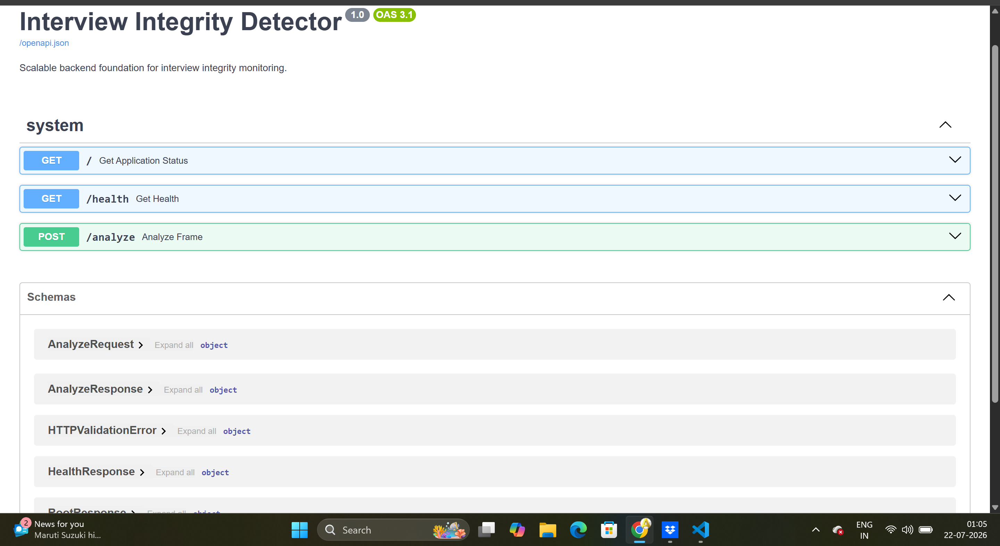
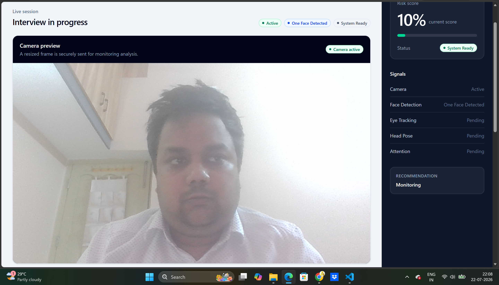
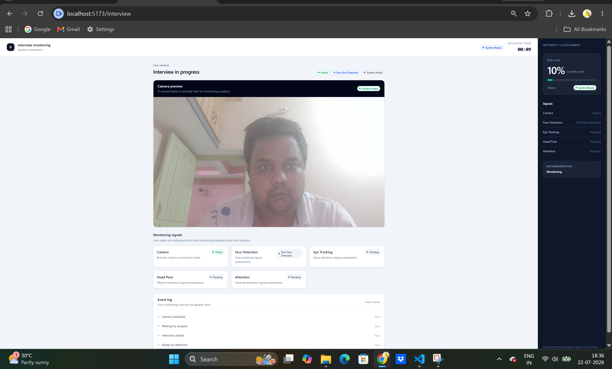
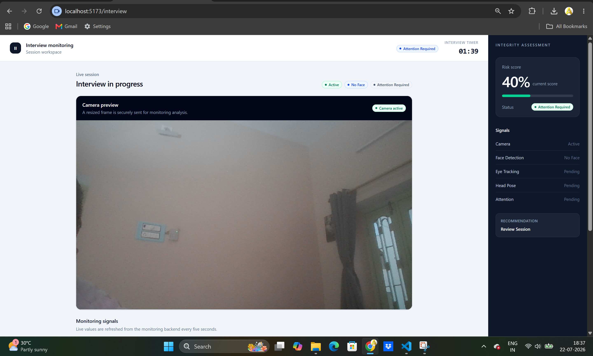
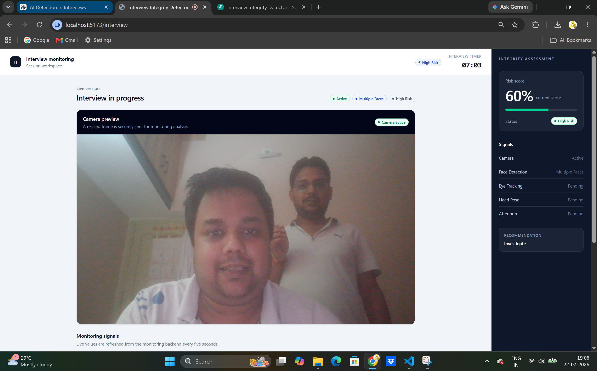
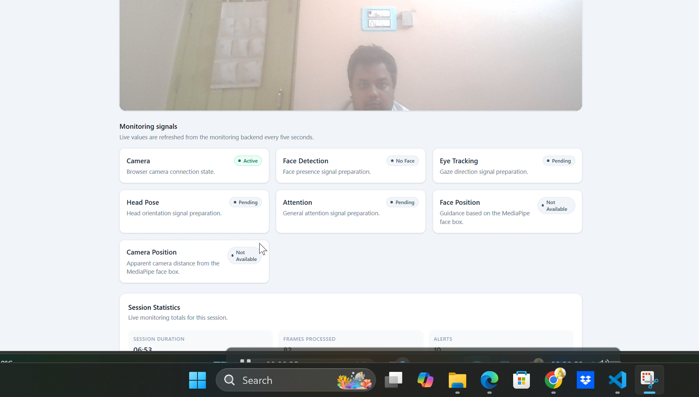
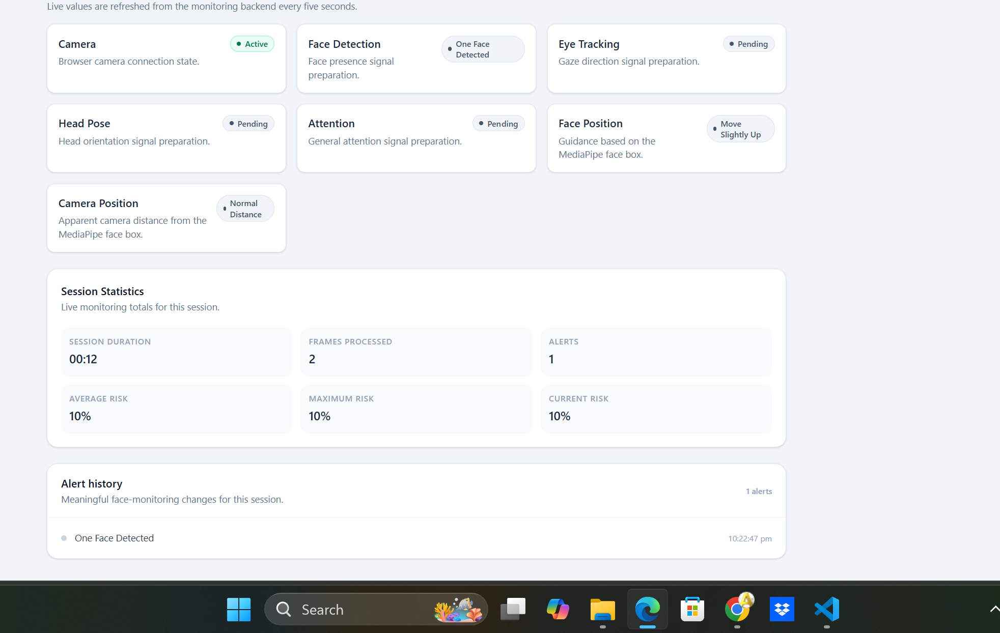

# Interview Integrity Detector

[](https://react.dev/)
[](https://fastapi.tiangolo.com/)
[](https://ai.google.dev/edge/mediapipe/solutions/guide)
[](https://www.python.org/)
[](#license)

> Zero-install, browser-based interview integrity monitoring prototype powered by React, FastAPI, and MediaPipe.

## Hackathon

**Built for the InCruiter Hackathon**  
**Problem Statement:** “Catch the Invisible AI Cheater”

## 🎯 Project Overview

Interview Integrity Detector supports structured review of remote interview sessions. The candidate grants browser-camera permission; the React application captures a resized JPEG frame from the live preview every five seconds and sends it to the FastAPI backend for analysis.

The backend decodes the Base64 JPEG, uses Google MediaPipe Face Detection to determine whether zero, one, or multiple faces are present, and returns an explainable rule-based risk response. The dashboard displays the latest monitoring result, session-only alert history, live statistics, and framing guidance.

The browser is the only camera owner. The backend processes only the frames received through the API and does not open a local webcam.

## 🧩 Problem Statement

Remote interviews make it difficult to establish consistent interview conditions while preserving a practical candidate experience. Interview teams need clear, reviewable signals when expected framing conditions change during a session.

This prototype addresses one limited part of that challenge through browser-based face-presence monitoring. It does not claim to directly identify AI interview assistants or guarantee detection of every form of suspicious behaviour.

## ✨ Features

- Zero-install browser workflow for the interview participant
- React, TypeScript, and Vite frontend with responsive dashboard UI
- Consent-first browser webcam capture
- Live monitoring dashboard with a risk assessment panel and signal cards
- Base64 JPEG frame transfer to FastAPI every five seconds
- Browser-owned camera flow; the backend never opens a local webcam
- Google MediaPipe face detection through the existing REST API
- One-face, no-face, and multiple-face monitoring states
- Deterministic risk score, status, and recommendation
- Face-position guidance from MediaPipe relative bounding-box data
- Apparent camera-distance validation from MediaPipe face-box area
- Session-only alert history with timestamps and consecutive-event deduplication
- Live session duration, frames processed, alert count, current, average, and maximum risk statistics
- End-of-session monitoring summary
- Axios API layer, typed API models, loading states, retry handling, and automatic polling cleanup
- CORS support for the React development server at `http://localhost:5173`

## 🛠️ Technology Stack

| Area | Technologies |
| --- | --- |
| Frontend | React, TypeScript, Vite, Tailwind CSS |
| Routing | React Router |
| API client | Axios |
| Backend | FastAPI, Pydantic, Uvicorn |
| Computer vision | OpenCV, Google MediaPipe Face Detection, NumPy |
| Communication | JSON REST API with Base64 JPEG frames |
| Containerization | Docker and Docker Compose |

## 🏗️ Architecture

```text
Browser Camera
      |
      v
React CameraView
      |
      v
Resize frame (maximum ~640 x 480) + JPEG encode (78% quality)
      |
      v
POST /analyze with Base64 image
      |
      v
FastAPI Backend
      |
      v
Base64 JPEG Frame Decoder
      |
      v
MediaPipe Face Detection
      |
      +------------------------------+
      |                              |
      v                              v
Face Position / Distance         Rule-Based Risk Engine
      |                              |
      +--------------+---------------+
                     v
              AnalyzeResponse
                     |
                     v
       React Dashboard, Alerts, and Statistics
```

> The backend never calls `cv2.VideoCapture()`; it analyzes only browser-provided frames.

## 🔄 Detection Workflow

1. The candidate starts an interview, reviews the consent information, and grants browser camera access.
2. The browser displays the local webcam preview.
3. The frontend captures a current preview frame every five seconds while the interview is active.
4. The frame is resized to a maximum of approximately 640×480, JPEG-encoded at 78% quality, and Base64-encoded.
5. The frontend sends `frame_id`, `timestamp`, and `image` to `POST /analyze`.
6. FastAPI decodes the JPEG payload into an OpenCV BGR frame.
7. MediaPipe Face Detection determines the face count and returns a relative face bounding box when exactly one face is present.
8. The backend derives face-position and apparent camera-distance guidance from that bounding box.
9. The rule engine produces the risk score, status, and recommendation.
10. The dashboard updates signals, alert history, and session statistics from the response.

## 🔌 Backend API

| Method | Endpoint | Description |
| --- | --- | --- |
| `GET` | `/` | Returns application name, version, and running status. |
| `GET` | `/health` | Returns the current backend health payload. |
| `POST` | `/analyze` | Accepts one browser-captured JPEG frame and returns monitoring data. |

### `POST /analyze`

Request body:

```json
{
  "frame_id": 1,
  "timestamp": "2026-07-23T12:00:00Z",
  "image": "base64-encoded-jpeg-data"
}
```

Response body:

```json
{
  "risk_score": 10,
  "status": "System Ready",
  "signals": {
    "camera": "Active",
    "face_detection": "One Face Detected",
    "eye_tracking": "Pending",
    "head_pose": "Pending",
    "attention": "Pending"
  },
  "face_position": "Centered",
  "face_distance": "Normal Distance",
  "recommendation": "Monitoring"
}
```

## 📊 Risk Scoring

The current risk engine is deterministic and based only on face-count state. Scores are clamped between 0 and 100.

| Face detection state | Risk score | Status | Recommendation |
| --- | ---: | --- | --- |
| One Face Detected | 10% | System Ready | Monitoring |
| No Face | 40% | Attention Required | Review Session |
| Multiple Faces | 60% | High Risk | Investigate |

## ✅ Current Capabilities

The current implementation captures browser webcam frames, transfers them to FastAPI as Base64 JPEG data, and applies MediaPipe face detection to identify zero, one, or multiple faces. The dashboard refreshes the monitoring response every five seconds while the session is active.

For exactly one detected face, the backend uses the existing MediaPipe relative bounding box to provide face-position and apparent camera-distance guidance. The dashboard also keeps a current-session alert history, avoids consecutive duplicate face-state alerts, and tracks duration, processed frames, alert count, current risk, average risk, and maximum risk.

When the interviewer ends the session, polling stops and the dashboard presents a monitoring summary. These values remain decision-support information; a human reviewer should make the final decision using full interview context.

## 🚀 Installation and Setup

### Prerequisites

- Node.js 20 or later
- Python 3.11 or later
- A browser with webcam support and permission enabled

### Backend

```powershell
cd backend
python -m venv .venv
.\.venv\Scripts\Activate.ps1
pip install -r requirements.txt
uvicorn app.main:app --reload --port 8000
```

The API is available at `http://localhost:8000`. Interactive API documentation is available at `http://localhost:8000/docs`.

### Frontend

Open a second terminal:

```powershell
cd frontend
npm install
npm run dev
```

Open the Vite URL shown in the terminal, normally `http://localhost:5173`.

### Docker

```bash
docker compose up --build
```

Docker serves the frontend at `http://localhost:5173` and the backend at `http://localhost:8000`.

## ▶️ Usage

1. Start the backend and frontend.
2. Open the frontend in a supported browser.
3. Select **Start Interview**, review the consent information, and provide consent.
4. Allow browser camera access on the interview page.
5. Review the dashboard as it refreshes monitoring data every five seconds.
6. Use **End session** to stop polling and view the Session Summary.

## 📁 Folder Structure

```text
Interview-Integrity-Detector/
├── frontend/
│   ├── src/
│   │   ├── api/                 Axios API client
│   │   ├── components/          Camera, dashboard, alert, and statistics UI
│   │   ├── hooks/               Monitoring polling and session statistics hooks
│   │   ├── pages/               Landing, consent, and interview pages
│   │   └── types/               TypeScript API interfaces
│   ├── package.json
│   └── vite.config.ts
├── backend/
│   ├── app/
│   │   ├── api/                 FastAPI route definitions
│   │   ├── models/              Pydantic request and response models
│   │   ├── services/            Monitoring orchestration and risk engine
│   │   ├── utils/               Logging utility
│   │   ├── vision/              Frame decoding and MediaPipe validation
│   │   ├── config.py
│   │   └── main.py
│   ├── requirements.txt
│   └── README.md
├── docs/
├── presentation/
├── screenshots/
├── tests/
├── docker-compose.yml
└── README.md
```

## 📸 Screenshots

### Landing Page



### Live Dashboard



### Face Detection States







### Session Insights





### Additional Screenshots

| Screenshot | Description |
| --- | --- |
| [02-backend-api-swagger.png](screenshots/02-backend-api-swagger.png) | FastAPI Swagger documentation |
| [02_backend_api_running.png](screenshots/02_backend_api_running.png) | Backend API running |
| [06-frontend-running.png](screenshots/06-frontend-running.png) | Frontend development server |
| [09_face_position_right.png](screenshots/09_face_position_right.png) | Face-position guidance |
| [10_face_position_left_distance.png](screenshots/10_face_position_left_distance.png) | Face-position and camera-distance guidance |
| [11_no_face_position.png](screenshots/11_no_face_position.png) | No-face position state |

## ⚠️ Limitations

- This is a hackathon prototype, not a complete production integrity platform.
- Current analysis is limited to face count and simple face-box framing heuristics for individual submitted frames.
- Face-position and camera-distance guidance are not identity, gaze, head-pose, or emotion analysis.
- Browser camera permission is required.
- The health endpoint currently returns a static scaffold payload.
- Human reviewers should make final decisions using full interview context.
- The system cannot guarantee detection of every cheating method or directly identify AI interview assistants.

## 🔮 Future Improvements

- Eye tracking and gaze estimation
- Head-pose estimation
- Object and phone detection
- Audio and speech-pattern analysis
- Session persistence, authentication, and reviewer workflows
- Expanded automated test coverage and production observability

## 🤝 Contributing

Contributions are welcome. Please open an issue to discuss a proposed change, then submit a focused pull request with clear context and appropriate tests where available.

## 📄 License

This project is licensed under the MIT License.
See the [LICENSE](LICENSE) file for details.

## 👤 Author

**Abhijeet**  
ME Embedded Systems  
BITS Pilani, Goa Campus  
Hackathon Submission
